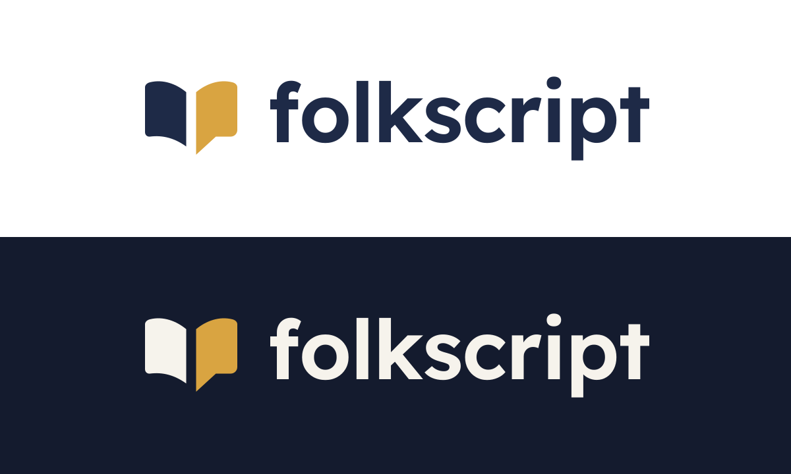

# Folkscript brand assets

The Folkscript logo pairs two open book pages with an outlined lowercase Lexend wordmark at weight 600. The gold right page forms a speech-bubble tail, connecting reading with people's voices. The identity keeps the site's navy `#1E2A47`, amber `#D9A441`, and warm dark-mode foreground `#F6F3EC`.

## Asset inventory

Paths below are relative to the repository root. All logo lettering is outlined, so the SVGs do not depend on installed fonts.

| Asset | Use |
| --- | --- |
| `public/images/folkscript-web-primary.svg` | Transparent navy-and-gold lockup for white and light surfaces; 312 × 64 viewBox. |
| `public/images/folkscript-web-dark.svg` | Transparent warm-white-and-gold lockup for dark surfaces; 312 × 64 viewBox. |
| `public/images/folkscript-web-mono.svg` | Transparent navy lockup for single-color applications on light surfaces; 312 × 64 viewBox. |
| `public/images/folkscript-logo-primary.svg` and `folkscript-logo-dark.svg` | Matching compact aliases of the light and dark web lockups, without a tagline. |
| `public/images/folkscript-mark-standalone.svg` | Transparent navy-and-gold standalone mark for light surfaces; 64 × 64 viewBox. |
| `public/images/folkscript-mark-dark.svg` | Transparent warm-white-and-gold standalone mark for dark surfaces; 64 × 64 viewBox. |
| `public/images/folkscript-icon-mark.svg` | Reversed mark on a rounded navy background for app identity; 96 × 96 viewBox. |
| `public/favicon.svg` | Coordinated navy-backed browser icon. |
| `public/apple-touch-icon.png`, `public/icon-192.png`, `public/icon-512.png` | Rasterized device icons at 180, 192, and 512 pixels square. |
| `public/og-default.svg` and `public/og-default.png` | Coordinated default social image at 1200 × 630 pixels. |
| `docs/brand/logo-preview.svg` and `docs/brand/logo-preview.png` | Preview of the identity and its applications. |

## Usage

- Render the full logo lockup at a minimum width of **120px**. Use the standalone mark when the full name cannot fit.
- Render a standalone mark at a minimum width of **16px**.
- Leave clear space around the artwork of at least **half the mark's rendered width**. In the full lockup, measure from the symbol, not the entire wordmark.
- Preserve the SVG aspect ratio. Do not stretch, crop, rotate, or redraw the artwork, or retype the outlined lettering.
- Select the light, dark, or monochrome asset for its intended background. Keep the transparent assets transparent; the navy-backed icon is the device/app treatment.
- Keep the lockup free of a tiny tagline. Use the product's supporting message as separate, readable text when needed.

## Provenance

The geometric symbol was authored as SVG. The wordmark was outlined from the bundled Lexend font at weight 600; the font is distributed under its existing [SIL Open Font License](../../public/fonts/lexend-LICENSE.txt). PNGs were rasterized from the SVG vectors without image generation. The previous supplied identity is preserved in Git history. See [Asset sources](../ASSETS.md) for the wider asset and license inventory.

## Preview

[Open the vector preview](logo-preview.svg).
